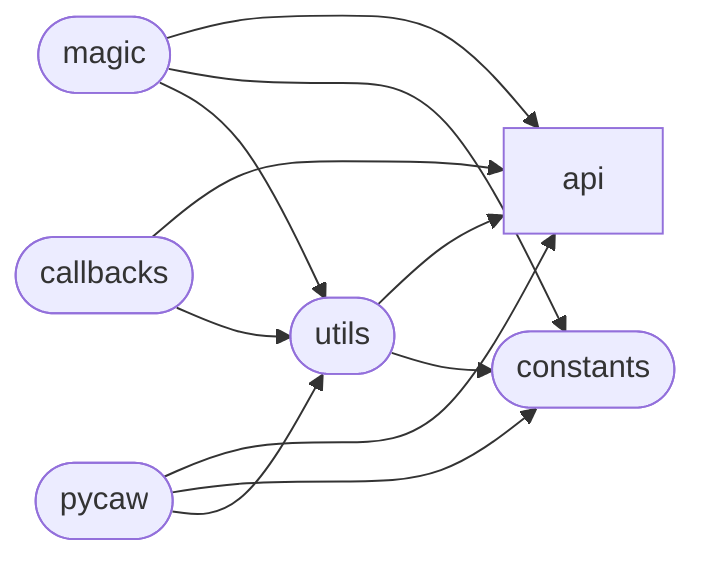

# Code Overview

[_Documentation generated by Documatic_](https://www.documatic.com)

<!---Documatic-section-Codebase Structure Python-start--->
## Codebase Structure Python

The codebase has a 3-deep folder structure,
                with 15 code files in total.

<!---Documatic-block-system_architecture-start--->

<!---Documatic-block-system_architecture-end--->

# #
<!---Documatic-section-Codebase Structure Python-end--->

<!---Documatic-section-Class Hierarchy-start--->
## Class Hierarchy

<!---Documatic-block-COMObject-start--->

	
<code>COMObject</code> (Click to Expand!)

* pycaw.callbacks.AudioEndpointVolumeCallback
* pycaw.callbacks.AudioSessionEvents
* pycaw.callbacks.AudioSessionNotification
* pycaw.magic.MagicManager
* pycaw.magic._MagicRootSession

<!---Documatic-block-COMObject-end--->

<!---Documatic-block-Enum-start--->

	
<code>Enum</code> (Click to Expand!)

* pycaw.constants.ERole

<!---Documatic-block-Enum-end--->

<!---Documatic-block-IUnknown-start--->

	
<code>IUnknown</code> (Click to Expand!)

* pycaw.api.audiopolicy.__init__.IAudioSessionControl
* pycaw.api.audiopolicy.__init__.IAudioSessionManager

<!---Documatic-block-IUnknown-end--->

<!---Documatic-block-pycaw.api.audiopolicy.__init__.IAudioSessionControl-start--->

	
<code>pycaw.api.audiopolicy.__init__.IAudioSessionControl</code> (Click to Expand!)

* pycaw.api.audiopolicy.__init__.IAudioSessionControl2

<!---Documatic-block-pycaw.api.audiopolicy.__init__.IAudioSessionControl-end--->

<!---Documatic-block-pycaw.api.audiopolicy.__init__.IAudioSessionManager-start--->

	
<code>pycaw.api.audiopolicy.__init__.IAudioSessionManager</code> (Click to Expand!)

* pycaw.api.audiopolicy.__init__.IAudioSessionManager2

<!---Documatic-block-pycaw.api.audiopolicy.__init__.IAudioSessionManager-end--->

<!---Documatic-block-pycaw.magic._MagicAudioControl-start--->

	
<code>pycaw.magic._MagicAudioControl</code> (Click to Expand!)

* pycaw.magic.MagicApp
* pycaw.magic.MagicSession

<!---Documatic-block-pycaw.magic._MagicAudioControl-end--->

# #
<!---Documatic-section-Class Hierarchy-end--->

[_Documentation generated by Documatic_](https://www.documatic.com)